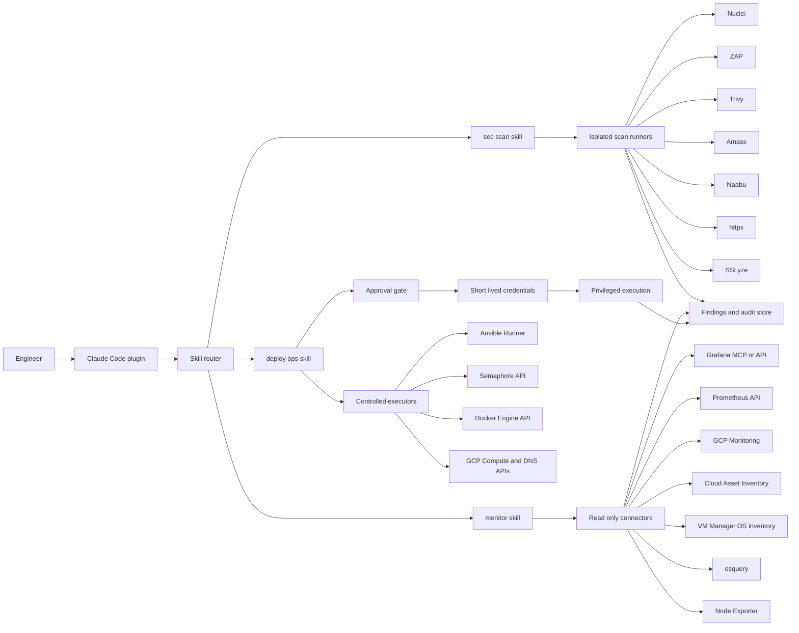
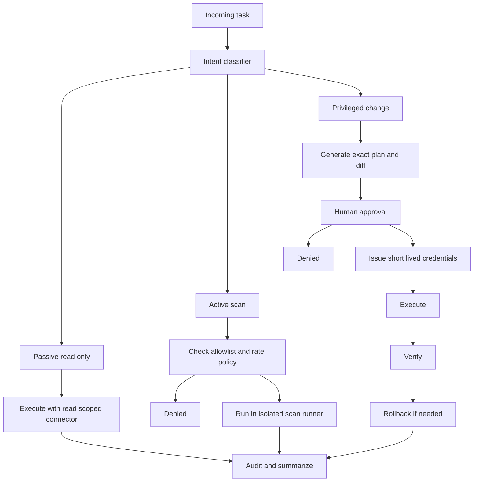

# Recommended Agent Design for Security, Monitoring, and Deployment Ops

## Executive summary

The best single fit for your use case is a plugin based agent on urlClaude Codeturn26search5, built around three skills and three matching subagents: `sec scan`, `monitor`, and `deploy ops`. The reason is practical rather than brand driven. Claude Code has first class custom subagents with tool restrictions, skills for repeatable workflows, hooks for policy enforcement, MCP connectivity for external systems, and a plugin system that can package skills, agents, hooks, and MCP servers together for team reuse. Its settings model can also centrally deny MCP servers, disable shell execution inside skills, and enforce managed policy precedence. For a Go heavy stack, the official Claude plugin marketplace also exposes a `gopls` code intelligence plugin, which improves navigation, references, diagnostics, and edit feedback in Go repos. citeturn10view2turn10view4turn14view3turn25view0turn25view1turn30view3turn30view4

A strong second path is urlCodex CLIturn11search16 or a custom agent built on the urlResponses APIturn31search6 plus the urlAgents SDKturn31search1. Codex also supports skills, plugins, MCP, approvals, and sandboxing, and it defaults to network off with workspace scoped execution unless you widen it. That makes it a very good option when you want an API first service, a custom remote app server, or tighter standardization on the OpenAI tool stack. If repository scanning in GitHub is especially important, urlCodex Securityturn14view0 is worth adding even if Claude is your main operator, because it scans connected GitHub repos commit by commit and validates likely issues before surfacing them. citeturn10view5turn10view6turn14view0turn14view1turn14view2turn25view7turn25view8turn25view9turn31search3turn31search6turn31search8turn31search12

The best architecture is a shared tool plane with read only defaults. Put all scanning and monitoring behind isolated runners and MCP or API connectors. Put all mutating deployment work behind an approval gate with exact diffs, short lived credentials, and rollback capture. In practice, that means passive asset discovery and observability queries can run freely with narrow read scopes, active scans should run only against an allowlisted scope and low rate limits, and deployment changes should never execute directly from a free form prompt. They should execute from approved plans against tightly scoped tools such as Ansible Runner, Semaphore, GCP APIs, or the Docker Engine API. citeturn23view0turn23view1turn23view3turn24search2turn9search0turn9search2turn9search10turn10view5turn17view1turn21view0turn21view4

## Recommended platform and tool fit

### Recommendation

Use a **Claude first, Codex assisted** design:

1. **Primary operator**  
   A Claude Code plugin named `ops guardian`, with three skills and three subagents:
   * `sec scan`
   * `monitor`
   * `deploy ops`

2. **Shared integration layer**  
   MCP when an official or well maintained server exists, direct REST or CLI adapters when it does not.

3. **Optional Codex additions**  
   * `Codex Security` for GitHub repo scanning
   * `Responses API` and `Agents SDK` only if you later want a server hosted assistant instead of a local or IDE operator

This split matches the current product strengths. Claude is stronger today for a terminal or IDE operator that needs packaged subagents, skill activation, hooks, and team shared policy in one place. Codex is stronger when you want a custom API service, remote app server patterns, or an extra GitHub focused scanning layer. citeturn10view2turn10view4turn30view3turn10view5turn10view6turn14view0turn25view7turn31search6turn31search12

### Comparison table

<table>
  <tr>
    <th>Option</th>
    <th>Best fit for your case</th>
    <th>What it gives you</th>
    <th>Main gaps</th>
    <th>Recommendation</th>
  </tr>
  <tr>
    <td>Claude Code plugin with skills and subagents</td>
    <td>Best single operator for security, monitoring, and deployment in one terminal or IDE workflow</td>
    <td>Plugins can package skills, agents, hooks, and MCP servers; subagents support tool restrictions; skills can pre approve tools; managed settings can block shell execution or named MCP servers; official plugin marketplace exists</td>
    <td>No built in hosted repo scanner comparable to Codex Security</td>
    <td><strong>Primary choice</strong> citeturn30view3turn10view2turn10view4turn25view0turn25view1turn26search2</td>
  </tr>
  <tr>
    <td>Codex skills and plugins</td>
    <td>Good if you want reusable workflows across CLI, IDE, and app with marketplace style distribution</td>
    <td>Skills follow the open Agent Skills standard; plugins are the installable unit; plugins can bundle skills and MCP config; approvals and sandbox are built in</td>
    <td>Less explicit subagent structure in the product workflow than Claude Code, based on currently surfaced docs</td>
    <td><strong>Second choice</strong> if you prefer Codex as the main shell agent citeturn10view6turn14view1turn14view2turn10view5</td>
  </tr>
  <tr>
    <td>Codex Security</td>
    <td>Repo scanning inside connected GitHub repositories</td>
    <td>Threat model aware repo scanning, validation in isolated environments, ranked findings, suggested fixes</td>
    <td>GitHub repo focused, not a broad infra monitor or deployment operator</td>
    <td><strong>Add as a side layer</strong> for code security findings citeturn14view0</td>
  </tr>
  <tr>
    <td>Grafana MCP server</td>
    <td>Read only monitoring and incident triage from dashboards, metrics, logs, alerts, incidents</td>
    <td>Metrics, logs, dashboards, alerting, incidents, deeplinks, RBAC aware access through Grafana service accounts</td>
    <td>Needs Grafana 9 and current RBAC hygiene for full value</td>
    <td><strong>Use</strong> if Grafana is present or likely to be introduced citeturn14view4turn17view0turn17view1</td>
  </tr>
  <tr>
    <td>Google Cloud remote MCP servers</td>
    <td>GCP resource inspection, inventory, and future tool based cloud actions</td>
    <td>IAM controls, service account or OAuth auth, toolsets to trim context, Model Armor support on supported endpoints</td>
    <td>Coverage varies by product; some tasks still need direct API or CLI calls</td>
    <td><strong>Use</strong> for GCP read paths first, direct APIs for gaps citeturn15view0turn15view1turn15view2</td>
  </tr>
  <tr>
    <td>Cloudflare Skills plugin and Cloudflare API MCP</td>
    <td>DNS, domain, edge, Zero Trust, and audit work if Cloudflare is in scope</td>
    <td>OAuth or token auth, broad API surface, plugin works with Claude Code and Codex, isolated execution model for the MCP server</td>
    <td>Only useful if your DNS or edge stack actually uses Cloudflare</td>
    <td><strong>Conditional</strong> add on for DNS and edge surfaces citeturn15view3turn16view0turn15view5</td>
  </tr>
  <tr>
    <td>Docker MCP Toolkit</td>
    <td>Running many MCP servers with safer local packaging and profile management</td>
    <td>Verified containerized MCP servers, profiles, gateway, signing, SBOMs, host filesystem isolation by default, OAuth handling</td>
    <td>Another control plane to manage</td>
    <td><strong>Use</strong> if you expect many MCP connectors across teams citeturn14view6turn14view7</td>
  </tr>
  <tr>
    <td>GitHub MCP Server</td>
    <td>Repo, PR, issue, and workflow visibility plus CI intelligence</td>
    <td>Official remote and local server, repo and PR automation, Actions workflow visibility, toolsets to reduce context load</td>
    <td>GitHub centered, not an infra operator by itself</td>
    <td><strong>Use</strong> for code and CI context in both Claude and Codex flows citeturn30view0turn30view1</td>
  </tr>
  <tr>
    <td>Responses API plus Agents SDK</td>
    <td>Server hosted assistant or shared internal service</td>
    <td>Tools, function calling, remote MCP, file search, web search, and agent orchestration primitives</td>
    <td>More engineering than a local skill or plugin</td>
    <td><strong>Use later</strong> if you want central hosting, observability, and productization citeturn31search0turn31search1turn31search3turn31search6turn31search8turn31search12</td>
  </tr>
</table>

## Capability inventory

### Security scanning

Your security skill should cover five layers: **asset discovery**, **protocol and edge checks**, **API specific checks**, **repo and image checks**, and **evidence normalization**. For attack surface discovery, the best open source set is entity["software","OWASP Amass","attack surface mapping framework"] for asset mapping, entity["software","Naabu","port scanner"] for port checks, and entity["software","httpx","HTTP probing tool"] for endpoint probing and screenshots. For web and API scanning, pair entity["software","OWASP ZAP","web and API security scanner"] with OpenAPI import and API scan mode, then add entity["software","Nuclei","template based vulnerability scanner"] for signature driven checks with explicit rate control. For repo, filesystem, image, and IaC checks, add entity["software","Trivy","security scanner"], which documents CVE, misconfiguration, secret, and license scanning across repos, filesystems, images, and clusters. For TLS and certificate posture, add entity["software","SSLyze","TLS configuration scanner"]. citeturn23view10turn23view12turn23view13turn24search2turn23view4turn24search3turn23view0turn23view1turn23view6turn23view7turn23view8turn23view9turn23view11

For DNS and domain surfaces, prefer cloud provider APIs when you own the zone and active discovery only when you need exposure mapping. On urlGoogle Cloud DNSturn19view7, the API exposes managed zone changes and record set operations. On Cloudflare, the public API surface covers DNS records, zone settings, audit logs, and DNS analytics, while the Cloudflare API MCP server can expose them through MCP with OAuth or tokens. That split matters because passive record inspection and audit retrieval are safe defaults, while active DNS or port discovery should be scoped and rate limited. citeturn19view7turn15view4turn15view5turn16view0turn15view3

The security skill should output **normalized findings** with: target, source tool, severity, proof, timestamp, confidence, exploitability, and suggested next action. `ZAP`, `Nuclei`, `Trivy`, and `Codex Security` all produce useful evidence, but they do so in different shapes. Unifying them into one schema is the difference between a research toy and an operator that can triage and drive change. Codex Security is especially useful for GitHub repo scanning because it adds repo context and isolated validation, which usually improves signal over generic pattern matching alone. citeturn14view0turn23view0turn24search2turn23view7

### Monitoring

For periodic read only checks, the cleanest design is **API first, agent second**. Use entity["software","Prometheus","monitoring system"] and entity["software","Grafana","observability platform"] where available, then use cloud inventories and host agents for what metrics do not show directly. Prometheus exposes a stable HTTP API under `/api/v1`, and PromQL supports both instant and range queries. Grafana exposes HTTP APIs for dashboards and alerts, and now also has an official MCP server that can query metrics and logs, search dashboards, manage alert rules, and generate deep links. Grafana service accounts and tokens inherit service account permissions, which makes them good for narrow read scopes. citeturn18view0turn18view1turn17view3turn17view4turn17view5turn14view4turn17view1

For host state such as disk, RAM, filesystem saturation, kernel details, running packages, and process level evidence, use a layered approach. entity["software","Node Exporter","Prometheus host metrics exporter"] is the simplest source of Linux machine metrics. entity["software","osquery","distributed host monitoring daemon"] adds SQL style operating system inspection, scheduled queries, remote logging, and optional distributed ad hoc queries. On GCP, VM Manager OS inventory can collect host, kernel, package, update, and vulnerability details every ten minutes, and the same data can be accessed through OS Config or Cloud Asset Inventory. That lets your monitoring skill detect version drift without live SSH into every VM. citeturn18view2turn18view3turn18view4turn18view5turn19view0turn19view1turn19view4turn20view2

For GCP specific infra posture, the core data sources are Cloud Monitoring, Cloud Asset Inventory, and managed instance group inspection. Cloud Monitoring exposes thousands of built in metrics and `timeSeries.list` for reads. Cloud Asset Inventory supports list, search, history, SQL style query jobs, and IAM analysis across cloud resources. MIG APIs and `gcloud` commands can show group policies, autohealing status, group stability, instance state, and errors. That is enough to power a read only health and drift agent for most VM based high availability stacks. citeturn19view2turn19view3turn19view4turn20view0turn20view1turn19view5turn19view6

### Deployment ops

Your deployment skill should understand **plan, diff, dry run, execute, verify, rollback**. For Linux and generic app deployment, prefer entity["software","Ansible Runner","Ansible execution interface"] as the execution adapter because it is designed as a stable Python and CLI interface around Ansible and is already the execution core under AWX lineage. If you already present automation through entity["software","Semaphore UI","automation web UI and API"], use it as the human facing job launcher and audit boundary, because it has an API, project model, templates, inventories, and task parameters suitable for controlled execution. citeturn21view0turn21view1turn21view2turn21view3

For container and service operations, use the entity["software","Docker Engine API","container runtime API"] and the documented semantics of entity["software","Docker Swarm","Docker clustering mode"] and entity["software","Docker Compose","multi container application tool"]. The Docker Engine API is RESTful and versioned. Swarm supports service inspection and service update workflows, and Docker docs state that an existing service can be changed with `docker service update`. Compose remains a valid production and CI control surface for multi container apps, especially when you want one YAML definition per stack. citeturn21view4turn21view6turn22search2turn22search0

For GCP rollout work on VM based high availability services, deployment ops should treat managed instance groups as the first class rollout target. MIG docs surface autohealing, automatic updating, regional deployment, autoscaling, and explicit group stability checks. That is a natural fit for gated rollouts where the agent first validates that the group is healthy and stable, then prepares the change, and only then calls the update path through Ansible, your CI system, or a cloud API. citeturn19view5turn19view6

## Integrations, data sources, and security model

### Required integrations and data sources

The minimum useful integration set is this:

<table>
  <tr>
    <th>Purpose</th>
    <th>Read path</th>
    <th>Change path</th>
    <th>Recommended connector style</th>
  </tr>
  <tr>
    <td>Code and CI</td>
    <td>GitHub repo state, PRs, issues, Actions runs</td>
    <td>PR creation, issue updates, workflow reruns when approved</td>
    <td>GitHub MCP Server</td>
  </tr>
  <tr>
    <td>GCP infra</td>
    <td>Cloud Monitoring, Cloud Asset Inventory, MIG state, OS inventory, Cloud DNS</td>
    <td>MIG updates, DNS changes, IAM controlled cloud operations</td>
    <td>Google Cloud MCP where available, direct REST or gcloud for gaps</td>
  </tr>
  <tr>
    <td>Observability</td>
    <td>Prometheus queries, Grafana dashboards, alerts, logs</td>
    <td>Alert rule changes only after approval</td>
    <td>Grafana MCP or direct Prometheus and Grafana APIs</td>
  </tr>
  <tr>
    <td>Hosts</td>
    <td>Node Exporter, osquery, VM Manager OS inventory</td>
    <td>None by default</td>
    <td>Pull metrics plus scheduled host agents</td>
  </tr>
  <tr>
    <td>Containers</td>
    <td>Docker Engine info, service inspect, image metadata</td>
    <td>Swarm or Compose deploys, image swaps, rollback</td>
    <td>Docker Engine API, optional Docker MCP tooling</td>
  </tr>
  <tr>
    <td>Automation</td>
    <td>Semaphore template and project state, Ansible artifacts</td>
    <td>Runner launch, approved template execution</td>
    <td>Ansible Runner adapter, Semaphore API</td>
  </tr>
  <tr>
    <td>External surface</td>
    <td>DNS records, audit logs, DNS analytics, attack surface results</td>
    <td>Only by explicit approval</td>
    <td>Cloudflare API or MCP if used, otherwise scanner runners</td>
  </tr>
</table>

This layout is grounded in the currently documented APIs and connectors for GitHub MCP, Google Cloud MCP and APIs, Grafana MCP and APIs, Prometheus HTTP API, VM Manager OS inventory, Docker Engine API, Ansible Runner, Semaphore UI, and Cloudflare APIs. citeturn30view1turn15view0turn15view1turn15view2turn19view2turn19view4turn19view6turn19view7turn14view4turn18view0turn19view0turn21view0turn21view3turn21view4turn15view3turn16view0

### Safe read only versus privileged actions

The control boundary should be explicit:

<table>
  <tr>
    <th>Action class</th>
    <th>Examples</th>
    <th>Default posture</th>
    <th>Controls</th>
  </tr>
  <tr>
    <td>Passive read only</td>
    <td>PromQL queries, Grafana dashboard reads, MIG describe, OS inventory reads, Docker info, Cloud DNS zone list, Cloudflare audit log reads</td>
    <td>Allowed</td>
    <td>Service accounts or OAuth with read scopes only, audit logging, response redaction</td>
  </tr>
  <tr>
    <td>Active but non mutating</td>
    <td>ZAP API scan, Nuclei, SSLyze, Naabu, httpx screenshots</td>
    <td>Blocked unless target is allowlisted</td>
    <td>Rate limits, maintenance windows, low parallelism, target scope file, scanner identity headers, separate runner</td>
  </tr>
  <tr>
    <td>Privileged changes</td>
    <td>Docker service update, Ansible playbook run, Semaphore deploy template launch, Cloud DNS change, MIG update</td>
    <td>Denied by default</td>
    <td>Two step approval, exact command or API diff, short lived credentials, preflight checks, rollback capture, post change verification</td>
  </tr>
</table>

This posture matches the documented security realities. Docker warns that the daemon runs as root and that membership in the `docker` group grants root level privileges. Grafana service account tokens inherit their service account permissions. Google Cloud recommends secure service account use and least privilege, and Google Cloud MCP auth docs are clear that actions performed through your credentials inherit your permissions and are attributed to that identity. Codex can operate in read only or workspace write modes with network off by default, while Claude Code supports policy driven permission and MCP restrictions plus disabling shell execution in skills. citeturn9search0turn25view6turn17view1turn9search2turn9search10turn15view2turn10view5turn25view8turn25view0turn25view1

## Recommended architecture

The architecture below assumes Claude as primary operator. The same tool plane can be reused from Codex because both products support skills and MCP. citeturn10view4turn10view6turn25view9turn14view3



A second policy flow is just as important as the tool graph. The agent should classify every requested action before it touches a tool. citeturn10view5turn25view0turn25view1turn9search2turn9search10



### Why this architecture fits your stack

Your stated stack points to **VM based high availability services with containerized applications**, not a pure cloud native control plane. That means the agent must be comfortable with Go repos, Docker images, Compose and Swarm services, MIG health and rollout status, Linux process and package state, and change systems like Ansible or Semaphore. The design above matches those realities more closely than a browser only coding assistant or a repo only scanner. It puts cloud APIs, host metrics, and deployment runtimes on equal footing with code intelligence. citeturn30view4turn22search2turn21view6turn19view5turn19view6turn21view0turn21view2

## Roadmap, prompts, and implementation checklist

### Prioritized roadmap

**Phase A** should deliver read only value first. Build the plugin shell, the three skills, the intent classifier, and the read only connectors for GitHub, Grafana or Prometheus, GCP inventory, MIG inspection, and Docker inspect flows. This phase gives you useful monitoring and diagnostics with the lowest risk. citeturn30view3turn30view1turn14view4turn18view0turn19view4turn19view6turn21view4

**Phase B** should add active security runners. Introduce Trivy, Nuclei, ZAP API mode, SSLyze, and attack surface discovery tools behind a strict scope file and runner policy. Add normalized findings and evidence links. For code scanning, wire in Codex Security only if your repos are in connected GitHub workspaces and you value a second signal source. citeturn23view0turn24search2turn23view7turn23view11turn23view10turn14view0

**Phase C** should add deployment control. Start with dry run and plan generation only. Then enable approved execution through Ansible Runner, Semaphore templates, Docker service updates, and narrowly scoped GCP change paths. Add automatic preflight checks, verification, and rollback metadata capture. citeturn21view0turn21view2turn21view3turn21view6turn19view6

**Phase D** should harden policy and scale. Move to managed settings, central plugin distribution, OAuth or service account rotation, action logging, evaluation harnesses, and maybe an API first service on Responses API if you want multi user shared access rather than local operator use. citeturn25view1turn26search0turn15view0turn15view2turn31search6turn31search12

### Implementation checklist

1. Create a Claude Code plugin repository with three skills, three agents, and one shared policy file. citeturn30view3turn26search3  
2. Install the Go code intelligence plugin so the agent has `gopls` backed diagnostics and navigation in Go repos. citeturn30view4  
3. Add GitHub MCP, Grafana MCP, and selected Google Cloud MCP servers, then keep direct API adapters for gaps. citeturn30view0turn14view4turn15view0  
4. Add direct REST clients for Prometheus, Cloud Monitoring, Cloud Asset Inventory, Cloud DNS, and Docker Engine. citeturn18view0turn19view3turn20view1turn19view7turn21view4  
5. Add Ansible Runner and, if present, Semaphore API bindings. citeturn21view0turn21view3  
6. Add isolated scan runners for Trivy, Nuclei, ZAP, SSLyze, Amass, Naabu, and httpx. citeturn23view0turn24search2turn23view7turn23view11turn23view10turn23view12turn23view13  
7. Implement the action classifier and enforce read only, active scan, and privileged change classes.  
8. Require exact diffs and human approval for all privileged actions.  
9. Create a normalized findings schema and a deployment event schema.  
10. Add transcript based evals and failure replay tests before production rollout.

### Recommended skill intents

A cross platform intent contract makes future migration between Claude and Codex much easier because both use the open Agent Skills model. citeturn10view4turn10view6

```json
{
  "intent": "security_scan.passive | security_scan.active | monitor.health | monitor.drift | deploy.plan | deploy.execute",
  "target_type": "repo | image | domain | host | api | service | mig | dns_zone",
  "scope": ["exact hosts, repos, zones, services, or projects"],
  "environment": "dev | staging | prod",
  "auth_mode": "anonymous | service_account | oauth | pat | delegated",
  "change_allowed": false,
  "approval_required": true,
  "evidence_required": true,
  "output_mode": "summary | triage | patch | plan | execution_record"
}
```

### Recommended prompts

Use short, explicit prompts that force scope and action class.

```text
Use sec scan in passive mode.

Scope:
  repo: ./services/payments
  image: registry.example.com/payments:current
  domain: api.example.com

Tasks:
  1. Find repo secrets, image CVEs, Dockerfile and IaC misconfigs.
  2. Enumerate exposed ports and TLS posture for api.example.com.
  3. If an OpenAPI document exists, import it into the API scanner and run only safe API checks.
  4. Return findings grouped by exploitability, with proof and remediation.
  5. Do not execute any mutating action.
```

```text
Use monitor.

Scope:
  gcp_project: prod-core
  mig: payments-regional-mig
  service: payments
  grafana_folder: payments

Tasks:
  1. Check MIG stability, autohealing status, recent errors, and instance health.
  2. Pull CPU, memory, disk, and restart indicators from Prometheus or Grafana.
  3. Compare running package and software versions across instances.
  4. Flag drift from the desired version map in docs/versions.yaml.
  5. Return only read only evidence and direct links where available.
```

```text
Use deploy ops in plan mode only.

Scope:
  repo: ./services/payments
  target: payments swarm service
  fallbacks:
    first: semaphore template deploy-payments
    second: ansible playbook payments_rollout.yml

Tasks:
  1. Build a rollout plan from current image to ghcr.io/acme/payments:v1.24.7.
  2. Show every command or API call that would run.
  3. Include preflight checks, blast radius, health gates, and rollback steps.
  4. Stop before execution and ask for approval.
```

### Skill skeleton

This pattern works well as the core `SKILL.md` for Claude, and the same logical structure also ports well to Codex skills. Claude specific fields such as `allowed-tools` should remain narrow. citeturn10view4turn14view2

```md
---
name: sec-scan
description: Investigate repositories, images, APIs, domains, and hosts for likely security issues. Default to passive collection and low impact checks. Require explicit approval for any active scan outside the allowlist.
allowed-tools: Bash(trivy *) Bash(nuclei *) Bash(zap-api-scan.py *) Bash(sslyze *) Bash(curl *) Read(*)
---

You are the security operator for backend, DNS, domain, REST API, and container surfaces.

Rules:
1. Start with inventory and exposure mapping.
2. Prefer passive reads and documented APIs over blind active probing.
3. If the target is production, lower scan rate and parallelism.
4. Never mutate infrastructure.
5. Return findings grouped by severity, exploitability, and confidence.
6. Include proof, likely root cause, and nearest code or config owner.
```

### Example API calls and runner commands

The examples below map directly to documented APIs and tools.

```bash
# Prometheus range query
curl -G "https://prom.example.com/api/v1/query_range" \
  --data-urlencode 'query=avg by(instance) (rate(node_cpu_seconds_total{mode!="idle"}[5m]))' \
  --data-urlencode 'start=2026-05-08T00:00:00Z' \
  --data-urlencode 'end=2026-05-08T01:00:00Z' \
  --data-urlencode 'step=30s'
```

```bash
# Grafana list dashboards
curl -H "Authorization: Bearer $GRAFANA_TOKEN" \
  "https://grafana.example.com/apis/dashboard.grafana.app/v1/namespaces/default/dashboards?limit=50"
```

```bash
# GCP Cloud Monitoring time series read
curl -H "Authorization: Bearer $ACCESS_TOKEN" \
  "https://monitoring.googleapis.com/v3/projects/$PROJECT_ID/timeSeries?filter=metric.type=\"compute.googleapis.com/instance/cpu/utilization\""
```

```bash
# GCP Cloud DNS change history
curl -H "Authorization: Bearer $ACCESS_TOKEN" \
  "https://dns.googleapis.com/dns/v1beta2/projects/$PROJECT_ID/managedZones/$ZONE/changes"
```

```bash
# Cloudflare audit logs
curl -H "Authorization: Bearer $CLOUDFLARE_API_TOKEN" \
  "https://api.cloudflare.com/client/v4/accounts/$ACCOUNT_ID/logs/audit?since=2026-05-01T00:00:00Z&before=2026-05-08T00:00:00Z"
```

```bash
# Docker Engine API info over local Unix socket
curl --unix-socket /var/run/docker.sock http://localhost/v1.54/info
```

```bash
# Passive repo and image scanning
trivy fs /workspace/repo
trivy image registry.example.com/payments:current
```

```bash
# Low impact nuclei scan
nuclei -l targets.txt -rl 20 -bulk-size 5 -c 5
```

```bash
# ZAP API scan from OpenAPI
zap-api-scan.py -t https://api.example.com/openapi.json -f openapi -r report.html -J report.json
```

```python
# Ansible Runner
import ansible_runner
r = ansible_runner.run(private_data_dir="/runner", playbook="payments_rollout.yml")
print(r.status, r.rc)
```

These examples align with the documented Prometheus API, Grafana dashboard API, Cloud Monitoring reads, Cloud DNS API, Cloudflare audit API, Docker Engine API, Trivy, Nuclei, ZAP API scan, and Ansible Runner Python interface. citeturn18view0turn17view4turn19view3turn19view7turn16view0turn21view4turn23view7turn23view0turn24search2turn21view0

## Testing, effort, risk, and limitations

### Testing and validation plan

Your validation plan should have four layers. First, **policy tests** should prove that read only prompts cannot cross into privileged tools without approval. Second, **connector tests** should replay known API responses from Grafana, Prometheus, GCP, Docker, and Semaphore or Ansible Runner and confirm stable parsing. Third, **skill evals** should run golden transcript cases for security triage, monitoring diagnostics, and deployment planning. Fourth, **staging execution tests** should verify plan, execute, verify, rollback flows against a non production environment with a real MIG, a real Swarm or Compose service, and a sample Grafana and Prometheus stack. ZAP and Nuclei should also be tested only against explicit demonstration or staging targets with written authorization. citeturn10view5turn25view1turn18view0turn17view4turn19view6turn21view6turn24search2turn23view1

Success metrics should be concrete. For security, measure accepted finding precision, duplicate rate, and time to triage. For monitoring, measure incident question answer latency and rate of correct root cause suggestions. For deployment, measure percentage of plans approved without manual edits, percentage of successful rollbacks, and rate of policy blocks that prevented unsafe execution. These are engineering metrics rather than vendor claims, so you should define thresholds that fit your environment.

### Estimated effort

Assuming one engineer who knows the stack and one engineer who can own the agent integration, a realistic estimate is:

* **Phase A**: 2 to 3 weeks  
  Core plugin, skills, read only connectors, reporting

* **Phase B**: 2 to 4 weeks  
  Scan runners, normalized findings, evidence storage

* **Phase C**: 2 to 3 weeks  
  Deployment plans, approval gate, execution adapters, rollback

* **Phase D**: 1 to 2 weeks  
  Hardening, eval harness, distribution, observability

That yields roughly **7 to 12 weeks** for a production ready first version. A narrower internal pilot with no change execution can land in **3 to 5 weeks**. This estimate is my scope based judgment, not a vendor stated timeline.

### Risk assessment

The highest risk is **credential overreach**. Docker daemon access is effectively privileged root access, and cloud or Grafana credentials inherit the roles you grant them. The safest pattern is one identity per connector, read scopes by default, and just in time elevation only for approved change paths. citeturn25view6turn17view1turn15view2turn9search10

The next risk is **prompt injection through external tools and MCP**. Claude’s MCP docs explicitly warn that third party MCP servers can expose you to prompt injection, especially when they fetch untrusted content. Google Cloud MCP adds IAM controls and Model Armor support on supported endpoints, which helps, but it does not remove the need for trust boundaries. Use official MCP servers where possible, and do not let an agent pipe arbitrary web content into privileged execution plans. citeturn14view3turn15view0turn14view7

A third risk is **false confidence from security scanners**. ZAP, Nuclei, Trivy, and attack surface tools all have blind spots or noisy edges. ZAP API scan is API focused, Trivy covers software and config surfaces, Nuclei is template driven, and Codex Security is repo centered. Treat the agent as a prioritizer and evidence collector, not as an authority that can waive human review. citeturn24search2turn23view7turn23view8turn23view0turn14view0

### Open questions and limitations

A few choices could change the final shape of the agent:

* If you already rely heavily on GitHub and want hosted scanning as a first class workflow, Codex Security becomes more valuable.
* If your observability stack lacks Prometheus or Grafana today, the monitoring skill should start from GCP Monitoring, VM Manager OS inventory, and Node Exporter or osquery.
* If Cloudflare is not part of your DNS or edge path, omit that integration entirely.
* If your deployment authority must remain inside existing CI or Semaphore, keep the agent in plan mode plus approved job launch mode, rather than direct Docker or cloud mutation.

Under your stated assumptions, though, the most defensible answer is still the same: **build a Claude Code plugin first, keep it read only by default, use official APIs and MCP servers for monitoring and inventory, isolate all scanners, and put deployment behind an explicit approval gate. Add Codex only where its sandboxing, API first stack, or Codex Security product gives a clear extra gain.** citeturn30view3turn10view2turn10view5turn14view0turn15view0turn14view4turn19view6turn21view0turn21view4