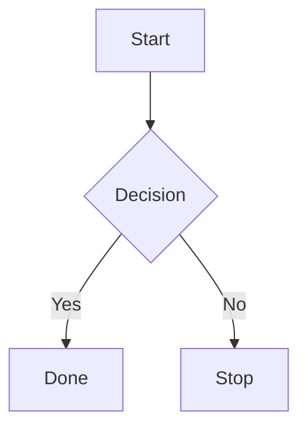

# Mermaid Reference

Adapted from the Mermaid skill at https://github.com/WH-2099/mermaid-skill.

Use Mermaid when the diagram should live in Markdown, docs, PRs, tickets, or any workflow where text diffs and easy editing matter.

## Workflow

1. Read the request and source context.
2. Choose the most specific Mermaid diagram type.
3. Use Mermaid syntax that renders directly.
4. Keep labels short, semantic, and stable.
5. Add styling only when it improves comprehension.

## Diagram Selection

| Need | Diagram type |
|---|---|
| Process, branching, operational flow | `flowchart` |
| API calls, service interactions, message exchange | `sequenceDiagram` |
| Classes, interfaces, inheritance, associations | `classDiagram` |
| States, lifecycle, transitions | `stateDiagram-v2` |
| Tables, entities, relationships | `erDiagram` |
| Project plan, rollout sequence, dated work | `gantt` |
| Milestones or chronological narrative | `timeline` |
| Git branches, merges, release flow | `gitGraph` |
| C4-style system context or containers | `C4Context` or `C4Container` |
| Requirements and traceability | `requirementDiagram` |
| Distribution or proportions | `pie` |
| Flow amounts, conversion, movement between buckets | `sankey-beta` |
| Hierarchy or idea map | `mindmap` |
| Work status lanes | `kanban` |
| Architecture components with groups | `architecture-beta` |

Prefer the common stable types (`flowchart`, `sequenceDiagram`, `classDiagram`, `stateDiagram-v2`, `erDiagram`) unless the request clearly benefits from a specialized type.

## Syntax Rules

- Wrap output in a fenced `mermaid` block.
- Use readable node IDs and labels.
- Quote labels that contain punctuation, parentheses, slashes, or special characters.
- Avoid excessive inline styling, HTML, or icons unless required by the target renderer.
- Keep line direction intentional: `TD` for top-down workflows, `LR` for request paths and pipelines.
- For technical diagrams, use real names from inspected source rather than generic `Service A` labels.

## Validation

- Check the diagram for balanced delimiters, valid arrows, unique node IDs, and supported Mermaid keywords.
- If a Mermaid renderer or CLI is available, render or parse the diagram before final output.
- If rendering is not available, manually inspect syntax and state that validation was static only.

## Output Shape

